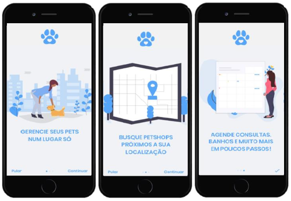

# PetCare

O projeto PetCare é um trabalho de conclusão de curso (TCC) que visa simplificar o agendamento de serviços relacionados a animais de estimação, como vacinas, consultas veterinárias e adoção de pets. Este projeto permite aos usuários localizar petshops nas proximidades, visualizar informações sobre os serviços oferecidos e agendar compromissos com facilidade. O PetCare foi desenvolvido utilizando as seguintes tecnologias: Expo (React Native), Styled Components, Node.js e MongoDB.

## Índice

- [Tecnologias Utilizadas](#tecnologias-utilizadas)
- [Capturas de Tela](#capturas-de-tela)
- [Funcionalidades Principais](#funcionalidades-principais)
- [Requisitos de Instalação](#requisitos-de-instalação)

## Tecnologias Utilizadas

- Expo (React Native): O PetCare utiliza o framework Expo para desenvolver aplicativos móveis multiplataforma. Isso proporciona a capacidade de criar aplicativos para Android e iOS com facilidade, bem como acesso a recursos nativos.
- Styled Components: A estilização do PetCare é feita com o auxílio da biblioteca Styled Components. Isso permite a criação de estilos dinâmicos e reutilizáveis para os componentes da interface do usuário.
- Node.js: O lado do servidor do PetCare é desenvolvido em Node.js, permitindo a criação de APIs para gerenciar os dados e as funcionalidades do aplicativo.
- MongoDB: O MongoDB é o banco de dados utilizado no PetCare para armazenar informações sobre petshops, serviços, usuários e agendamentos.

## Capturas de Tela

   <h3>Onboarding</h3>
        
    <h3>Home</h3>
        
    <h3>Mapa e rotas</h3>
        

## Funcionalidades Principais

- Busca de Petshops: Os usuários podem pesquisar petshops com base em sua localização atual ou em um local específico.
- Listagem de Serviços: O aplicativo exibe uma lista de serviços oferecidos pelos petshops, incluindo vacinas, consultas veterinárias, banho e tosa, além da possibilidade de adoção de animais.
- Agendamento de Serviços: Os usuários podem visualizar detalhes sobre os serviços e agendar consultas ou outros serviços disponíveis.
- Perfil de Usuário: Os usuários podem criar perfis, incluindo informações sobre seus animais de estimação, como nome, raça e histórico de saúde.
- Notificações: O PetCare oferece notificações para lembrar os usuários de consultas agendadas e outras informações importantes.
- Sistema de Autenticação: O projeto inclui um sistema de autenticação para proteger os dados do usuário.